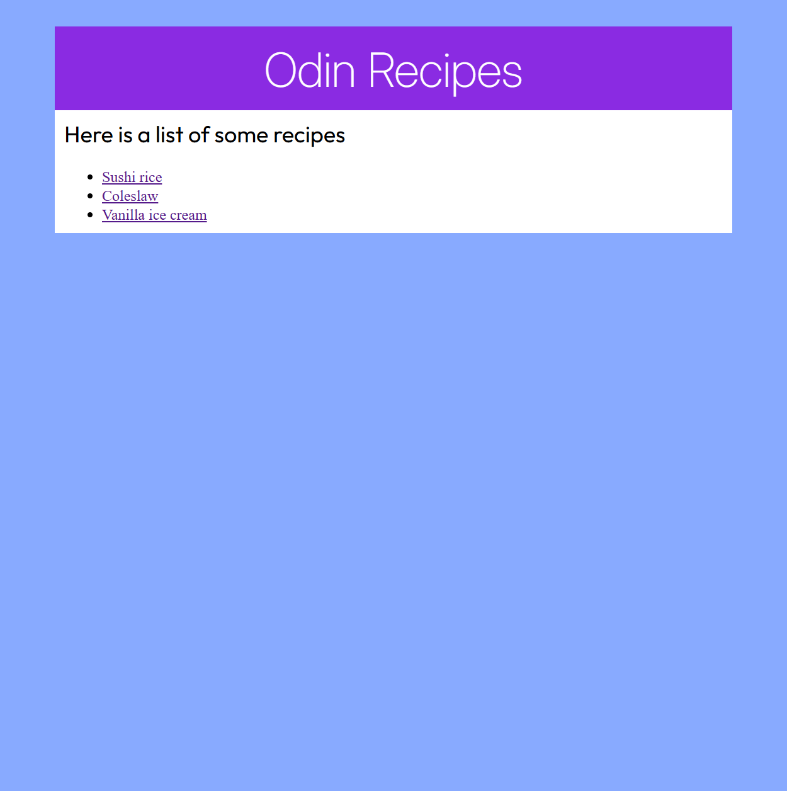
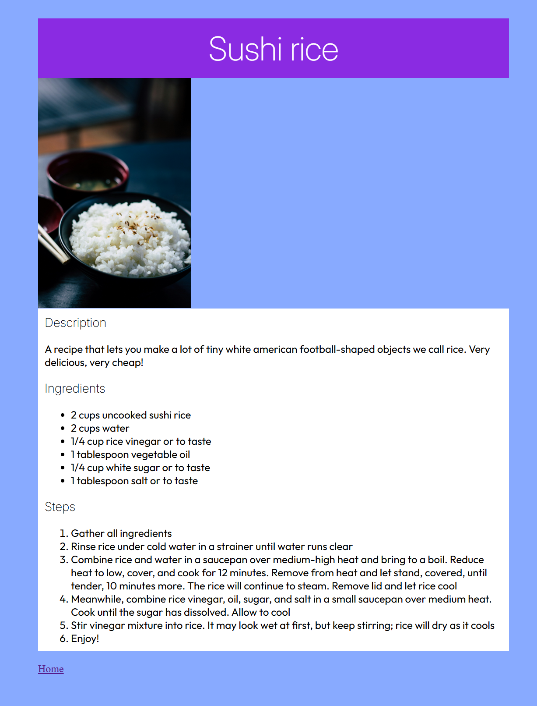
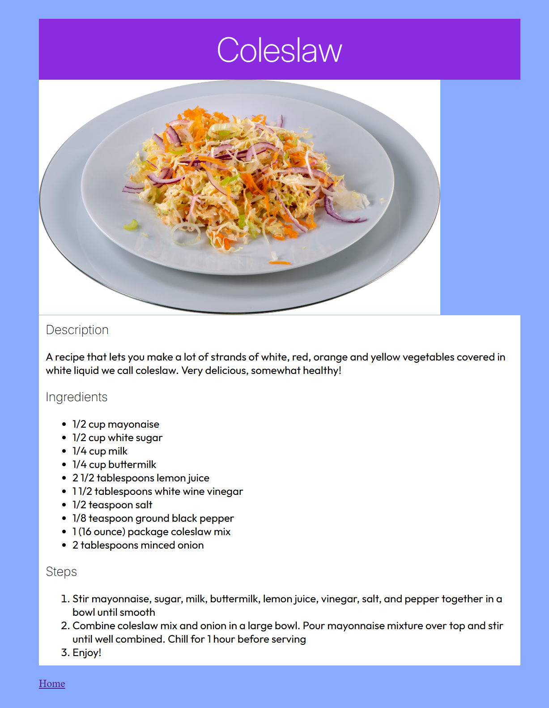
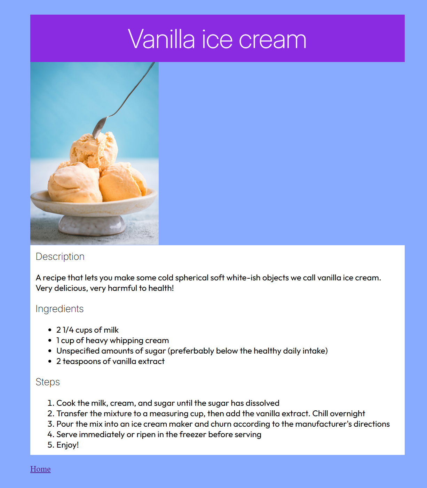

# odin-recipes
This is a simple HTML-only website project based on The Odin Project curriculun. (CSS was added after learning it in The Odin Project.)

Live demo link: https://j0e-quan.github.io/odin-recipes/

## Technologies used:
 - HTML for page layout, links and images
 - CSS for styling pages and using web fonts
 - Git for version control

## Key features:
 - Main index page contains links to several recipe pages
 - Recipe pages contain images and links back to the index page
 - All pages are styled with CSS and use web fonts (Inter for headings, Outfit for body text)
 - Pages are scaled appropriately on mobile (except for images)

## Credits:
 - ALL recipes were taken from www.allrecipes.com
 - sushi-rice.jpg was taken from Vinn Koonyosying on Unsplash
 - coleslaw.jpg was taken from Jacques Bopp on Unsplash
 - vanilla-ice-cream.jpg was taken from Dovile Ramoskaite on Unsplash

## Gallery:

